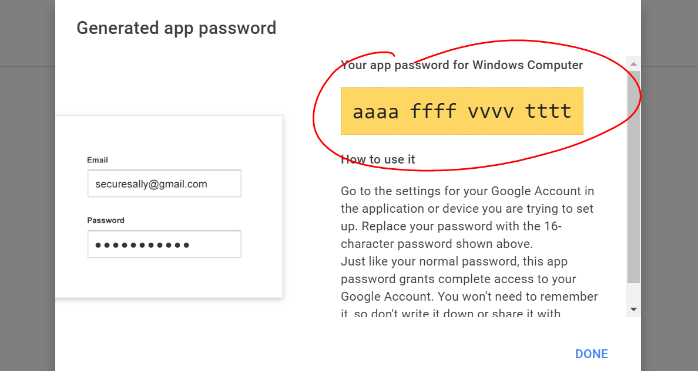

# How to access Gmail inbox through python - Mohamed Sagou

This tutorial will show you how to connect, access and read Gmail inbox with python. You need to have python 3 and PIP installed in your pc.

## Table of contents

- [How to get user name and passowrd for connection](#How-to-get-user-name-and-passowrd-for-connection)
    - [Get Username](#How-to-get-user-name-and-passowrd-for-connection)
    - [Get Password](#How-to-get-user-name-and-passowrd-for-connection)
- [Require python code to read gmail inbox](#what-is-my-the-version-of-gulp?)
- [All the above code](#All-the-above-code)
- [Author](#author)


## How to get user name and passowrd for connection

### Username

The username you will need for this connection is just the gmail username of the inbox that you want to read. example : 
```powershell
sakou81****@gmail.com
```
### Password
This is the important section of this hole process. The password that your python code will be use is actually a appkey generated by gmail it self.</br>
First You need to login on your Gmail account, click on your profile picture on top right then go to "Manage your Google Account".
</br>


</br>
</br>

After that go to Security -> Scroll to "Signing in to Google", make sure that 2-step verification is on.
</br>


</br>
</br>

If so, then go to "App passwords", you may have to login again. Next, select the following fields, you may change the second field if your platform is different. Then click GENERATE button.
</br>


</br>
</br>

After generating the app password, you will have something similar to the folowwing screenshot (In my case it's a fake password). Store the password that is provided in the following part, the you will be ready to the next step.
</br>


</br>
</br>

## Require python code to read gmail inbox
Import "email" and "imaplib" modules.

```python
import email
import imaplib
```
Store our "username" (Gmail username) and app password in a variables.
```python
user = "example@gmail.com"
gmail_pass = "aaaaffffvvvvtttt"
host = "imap.gmail.com"
```
Define the function with the parameters to decide how many emails to show, and if to contain the body of the email or not, both with defaults.
```python
def read_email_from_gmail(count=3, contain_body = False):
```
Create server and login.
```python
    mail = imaplib.IMAP4_SSL(host)
    mail.login(user, gmail_pass)
```
Using SELECT to chose the e-mails.
```python
   res, messages = mail.select('INBOX')
```
Caluclating the total number of sent Emails
```python
     messages = int(messages[0])
```
Iterating over the sent emails
```python
        for i in range(messages, messages - count, -1):
        # RFC822 protocol
        res, msg = mail.fetch(str(i), "(RFC822)")
        for response in msg:
            if isinstance(response, tuple):
                msg = email.message_from_bytes(response[1])

                # Store the senders email
                sender = msg["From"]

                # Store subject of the email
                subject = msg["Subject"]

                # Store Body
                body = ""
                temp = msg
                if temp.is_multipart():
                    for part in temp.walk():
                        ctype = part.get_content_type()
                        cdispo = str(part.get('Content-Disposition'))

                        # skip text/plain type
                        if ctype == 'text/plain' and 'attachment' not in cdispo:
                            body = part.get_payload(decode=True)  # decode
                            break
                else:
                    body = temp.get_payload(decode=True)

                # Print Sender, Subject, Body
                print("-"*50)  # To divide the messages
                print("From    : ", sender)
                print("Subject : ", subject)
                if(contain_body):
                    print("Body    : ", body.decode())
```
Close the connection.
```python
    mail.close()
    mail.logout()
```
Call our function.
```python
    read_email_from_gmail(3, True)
```
</br>
</br>

## All the above code
</br>

```python
import email
import imaplib


user = "example@gmail.com"
gmail_pass = "aaaaffffvvvvtttt"
host = "imap.gmail.com"
def read_email_from_gmail(count=3, contain_body=False):

    # Create server and login
    mail = imaplib.IMAP4_SSL(host)
    mail.login(user, gmail_pass)

    # Using SELECT to chose the e-mails.
    res, messages = mail.select('INBOX')

    # Caluclating the total number of sent Emails
    messages = int(messages[0])

    # Iterating over the sent emails
    for i in range(messages, messages - count, -1):
        # RFC822 protocol
        res, msg = mail.fetch(str(i), "(RFC822)")
        for response in msg:
            if isinstance(response, tuple):
                msg = email.message_from_bytes(response[1])

                # Store the senders email
                sender = msg["From"]

                # Store subject of the email
                subject = msg["Subject"]

                # Store Body
                body = ""
                temp = msg
                if temp.is_multipart():
                    for part in temp.walk():
                        ctype = part.get_content_type()
                        cdispo = str(part.get('Content-Disposition'))

                        # skip text/plain type
                        if ctype == 'text/plain' and 'attachment' not in cdispo:
                            body = part.get_payload(decode=True)  # decode
                            break
                else:
                    body = temp.get_payload(decode=True)

                # Print Sender, Subject, Body
                print("-"*50)  # To divide the messages
                print("From    : ", sender)
                print("Subject : ", subject)
                if(contain_body):
                    print("Body    : ", body.decode())
    # Close the connection.
    mail.close()
    mail.logout()

# Call the function.
read_email_from_gmail(3, True)

```
You Will find the .py file included in this repository as well.
## Author

- Originale repository - [Read-email-from-gmail-inbox-using-python](https://github.com/medsagou/Read-email-from-gmail-inbox-using-python)
- Website - [github.com/medsagou](https://github.com/medsagou)
- Frontend Mentor - [@medsagou](https://www.frontendmentor.io/profile/medsagou)
- Twitter - [@sagoumohamed](https://www.twitter.com/sagoumohamed)
- stackoverflow - [@medsagou](https://stackoverflow.com/users/19887099/mohamed-sagou)
- Linkedin - [Mohamed Sagou](https://www.linkedin.com/in/mohamed-sagou-8145b3246/)

